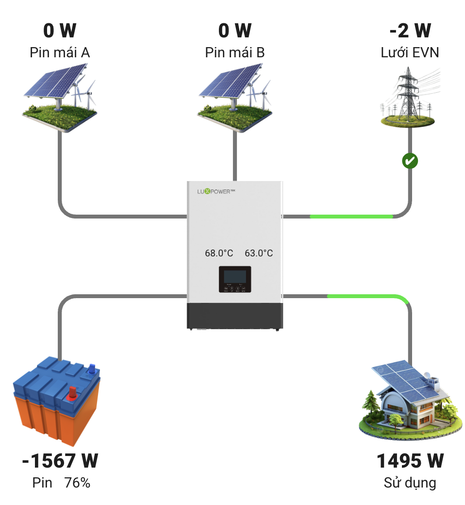
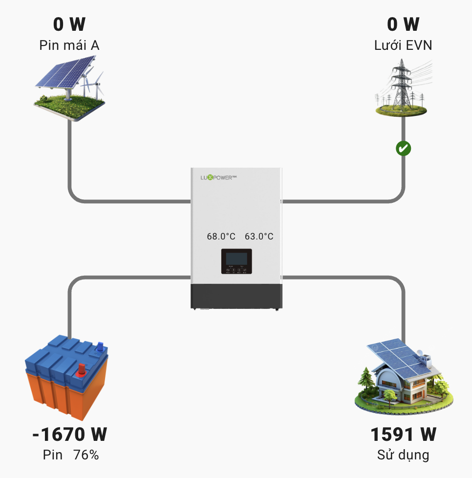

# 🧭 tb-energy-flow-card

Hiển thị trực quan dòng điện năng lượng mặt trời trong Home Assistant. Hỗ trợ inverter, lưới, pin, vi mô, tải với hoạt ảnh sinh động theo hướng dòng điện.


## 🔧 Tính năng chính

- Sơ đồ năng lượng dạng SVG với layout cố định, đẹp mắt.
- Hiển thị 5 thành phần: Solar, Grid, Battery, Micro Inverter, Load.
- Hoạt ảnh dòng điện chạy theo chiều thực tế, có thể đảo chiều với Grid và Battery.
- Line và highlight có thể tùy chỉnh màu sắc.
- Hỗ trợ Dark mode.
- Cho phép đổi tên, biểu tượng, hình ảnh, font size, vị trí từng thành phần.
- Hỗ trợ ảnh Inverter trung tâm và tùy chỉnh kích thước.

## ⚙️ Cài đặt

1. Tải file `tb-energy-flow-card.js` về và đặt vào thư mục `/config/www/` trong Home Assistant.
2. Thêm vào `resources` thông qua UI hoặc `configuration.yaml`:

```yaml
resources:
  - url: /local/tb-energy-flow-card.js
    type: module
```

## Code mẫu
```yaml
type: custom:tb-energy-flow-card
show_micro: true
show_solar2: true
solar: sensor.esp_inverter_pv1_power
solar2: sensor.esp_inverter_pv2_power
glow_size: 8
grid: sensor.esp_inverter_grid_ct_power
battery: sensor.esp_inverter_battery_power
entity_micro: sensor.esp_inverter_aux_power
load: sensor.esp_inverter_load_power
soc: sensor.soc_giao_tiep
grid_status: binary_sensor.esp_inverter_grid_connected_status
grid_status_x: 520
grid_status_y: 180
name_solar: String 1
name_solar2: String 2
name_grid: Lưới EVN
name_battery: Pin
name_micro: Deye OnGrid
name_load: Tải nhà
image_solar: >-
  https://png.pngtree.com/png-vector/20240720/ourmid/pngtree-sustainable-solar-water-pump-on-transparent-background-png-image_12963933.png
image_solar2: >-
  https://png.pngtree.com/png-vector/20240720/ourmid/pngtree-sustainable-solar-water-pump-on-transparent-background-png-image_12963933.png
image_grid: >-
  https://png.pngtree.com/png-vector/20250105/ourmid/pngtree-d-model-of-a-steel-transmission-tower-with-power-lines-on-png-image_15054625.png
image_battery: https://bachtran.net/ha/img/battery.png
image_micro: https://tpenergy.com.vn/wp-content/uploads/2023/10/3-1-1.png
image_load: https://bachtran.net/ha/img/home.png
inverter_image: https://bachtran.net/wp-content/uploads/2025/07/deye1.png
line_color: "#dfdfdf"
line_width: 3
highlight_color: red
invert_grid: true
invert_battery: true
decimal_precision: false
highlight_length: 60
animation_duration: auto
image_y_offset_top: -50
image_y_offset_bottom: -95
image_size_top: 100
image_size_bottom: 150
inverter_image_width: 800
inverter_image_height: 200
label_y_offset_top: -50
value_y_offset_top: -75
label_y_offset_bottom: 90
value_y_offset_bottom: 65
font_size_label: 18
font_size_value: 25
font_weight_value: 1000
temp:
  ac: sensor.esp_inverter_radiator_temperature
  dc: sensor.esp_inverter_dc_transformer_temperature
temp_position:
  ac:
    x: 390
    "y": 340
  dc:
    x: 215
    "y": 340
temp_font:
  size: 15
  weight: normal


```
## Các kiểu hiển thị khác

### Có 2 PV


Cách làm là thay đổi link hình ảnh và thực thể của micro inverter thành hình ảnh của String PV với thực thể PV2

### Không có micro inverter


Cách làm chỉnh lại `show_micro: true` thành `show_micro: false`


## Tùy chỉnh
Các bạn có thể tùy chỉnh các thông số
| Tùy chọn                | Mô tả                                                      |
| ----------------------- | ---------------------------------------------------------- |
| `entities`              | Định nghĩa các thực thể: solar, grid, battery, micro, load |
| `name`                  | Tên hiển thị cho từng thành phần                           |
| `invert_grid`           | Đảo chiều animation của dòng điện lưới                     |
| `invert_battery`        | Đảo chiều animation của pin                                |
| `line_color`            | Màu của đường dẫn điện (mặc định: cam)                     |
| `highlight_color`       | Màu vệt sáng di chuyển trên line                           |
| `image_y_offset_top`    | Dịch chuyển trục Y nhóm hình ảnh phía trên                 |
| `image_y_offset_bottom` | Dịch chuyển trục Y nhóm hình ảnh phía dưới                 |
| `image_size_top`        | Kích thước hình ảnh nhóm trên                              |
| `image_size_bottom`     | Kích thước hình ảnh nhóm dưới                              |
| `font_size_label`       | Cỡ chữ của nhãn                                            |
| `font_size_value`       | Cỡ chữ của giá trị                                         |
| `font_weight_value`     | Độ đậm chữ số liệu                                         |
| `decimal_precision`     | Số chữ số thập phân hiển thị                               |
| `show_micro`            | Cho hiển thị micro inverter                                |
| `show_solar2`           | Cho hiển thị thêm string PV                                |
